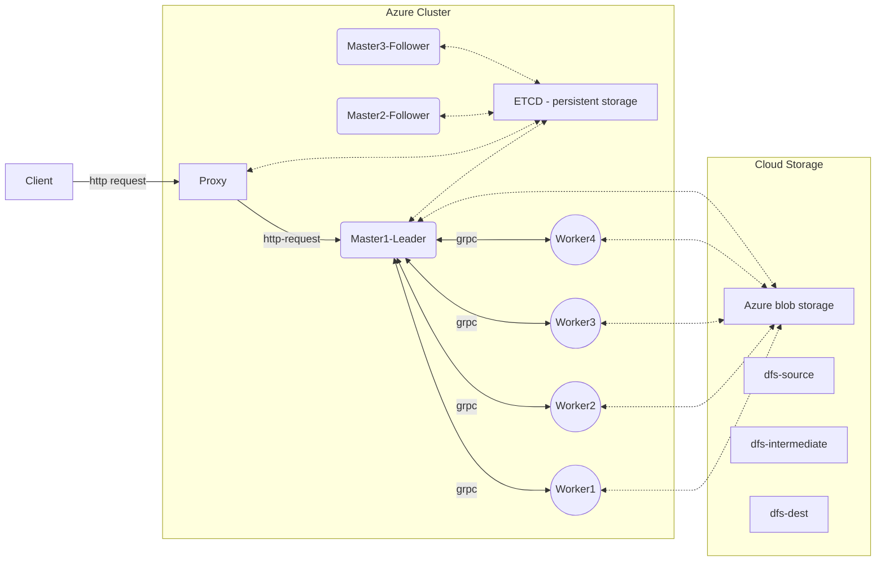

# Map Reduce Project

> Note that this is just a reference code which is not expected to be used in prod or maintained.

This project is to write a map reduce framework in C++, and deploy to Azure kubernetes cluster. The application of map reduce is to process large amount of data, hence the mappers and reducers here works in a distributed manner with M number of masters and N number of workers.

In this application, we are treating workers as agnostic agent that is able to act as a mapper/reducer. To spawn multiple workers & masters, Kubenetes will spin up multiple replicas of the workers and masters pods. The master will then assign the tasks to the workers. The master will also keep track of the status of the tasks, and will report back to the client when the job is done. Leader election is also implemented to ensure that there is only one master that accepts requests at a time. Etcd is used to store the master information. A proxy server is also deployed to handle the client requests and forward the requests to the master (leader). 



Fault tolerance is also implemented in the master, where if the leader fails, the other masters will take over the leadership, while getting the latest state from the etcd. Furthermore, the master is also able to handle the case where a worker fails, and will reassign the task to another worker.

-----

Note there are 2 versions of the azure-blob-storage library. One is the older version (`azure-storage-cpp`), the other is the newer version, which is part of the `azure-sdk-for-cpp`.

Please refer to this link: https://devblogs.microsoft.com/azure-sdk/intro-cpp-sdk/

## Build docker images

```
docker build -t sys-base -f docker/base.Dockerfile .
docker build -t mr-master -f docker/Dockerfile.master .
docker build -t mr-worker -f docker/Dockerfile.worker .
docker build -t mr-proxy -f docker/Dockerfile.worker .
```
### Test run docker image

```bash
docker run -it --rm --network host --name mr-master mr-master
docker run -it --rm --network host --name mr-worker mr-worker

# Add this for specific RPC port:  --env RPC_PORT=50051
docker run -it --rm --network host --env RPC_PORT=50051 --name mr-worker1 mr-worker
```

## push to azure docker registry
```bash
docker tag mr-master team14registry.azurecr.io/mr-master:latest
docker tag mr-worker team14registry.azurecr.io/mr-worker:latest
docker tag mr-proxy team14registry.azurecr.io/mr-proxy:latest
docker push team14registry.azurecr.io/mr-master:latest
docker push team14registry.azurecr.io/mr-worker:latest
docker push team14registry.azurecr.io/mr-proxy:latest
```

## Or build locally
```
./install_library.sh
```

```bash
mkdir build
cmake ..
make
```

## Setup Azure Cloud infrastructure

Install Azure cli 
```bash
curl -sL https://aka.ms/InstallAzureCLIDeb | sudo bash
```

Read this to setup Azure cloud infrastructure
- Azure Kubernetes Cluster: [link](https://docs.microsoft.com/en-us/azure/aks/kubernetes-walkthrough-portal)
- Azure Blob Storage: [link](https://learn.microsoft.com/en-us/azure/storage/blobs/storage-quickstart-blobs-portal)
- Azure Container Registry: [link](https://docs.microsoft.com/en-us/azure/container-registry/container-registry-get-started-azure-cli)


Login to AKS

```bash
# run on local
az acr login --name team14registry
```

### Kube AKS deployment

To deploy the master and worker pods
```bash
kubectl create ns cloud-sys
# etcd
helm install -n cloud-sys etcd bitnami/etcd --set auth.rbac.create=false

# Deploy srvs, worker and master
kubectl apply -f deploy/k8s-worker.yaml -n cloud-sys
kubectl apply -f deploy/k8s-master.yaml -n cloud-sys
kubectl apply -f deploy/k8s-ingress.yaml -n cloud-sys

# check the pods
kubectl -n cloud-sys get pods -o wide
kubectl logs -n cloud-sys <POD_NAME>
```

Delete pods
```bash
kubectl delete deploy worker -n cloud-sys
kubectl delete statefulsets master -n cloud-sys # since master is a statefulset
kubectl delete deploy proxy -n cloud-sys
```

To delete the entire cluster
```bash
kubectl get deployments --all-namespaces=true
kubectl delete ns cloud-sys
helm delete etcd -n cloud-sys
```

NOTE: when delete etcd, there is a persistent volume claim that is not deleted. You need to manually delete it.
```bash
kubectl delete pvc data-etcd-0 -n cloud-sys # something like this
```

# Useful command 
```bash 
docker kill $(docker ps -q)
```

```bash
curl -X POST http://52.226.247.116/request -H 'Content-Type: application/json' -d '{"mapper":"mapper.py","reducer":"reducer.py", "data":"dfs-source-small", "m_num" : 20, "r_num": 5}'

curl -X POST http://localhost:8080/request -H 'Content-Type: application/json' -d '{"mapper":"mapper.py","reducer":"reducer.py", "data":"dfs-source-small", "m_num" : 5, "r_num": 3, "phase": "map"}'

curl -X POST http://localhost:8080/request -H 'Content-Type: application/json' -d '{"mapper":"mapper.py","reducer":"reducer.py", "data":"dfs-source-small", "m_num" : 5, "r_num": 3, "phase": "reduce"}'
```

## User python interface

The user interface is a python script that will help you to upload data and scripts to azure blob storage.

### Setup

On project folder, create folder and sub-folder: 
- `data/`
    - `data/small`: small data set
    - `data/large`: put all files (1GB in total)
- `py_scripts/`: consists of `mapper.py`, `reducer.py` implementation. This will get called  inside

```bash
# install
pip3 install azure-storage-blob

# set env variable first
export AZURE_STORAGE_CONNECTION_STRING=XXXXX

# run the script to reset & upload data/scripts to azure
python3 user_interface.py
```

```
echo "foo foo quux labs foo bar quux" | python3 mapper.py | sort -k1,1 | python3 reducer.py
```
