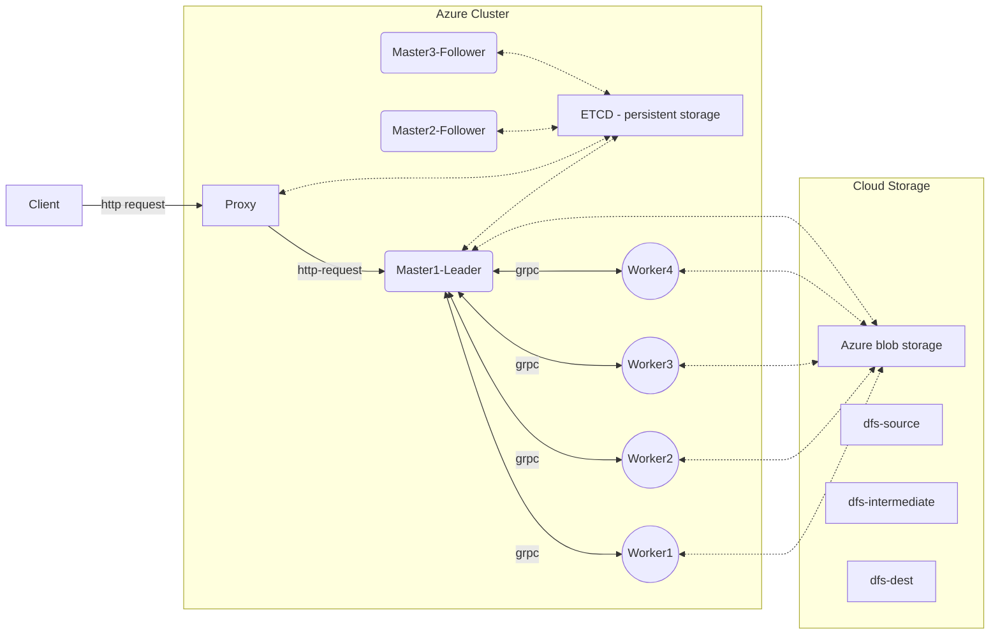

# Map Reduce on Azure
## High level description
My project with @youliangtan, forked from his repo. We use the school's GitHub account for the initial development, so all the git history is gone after porting over to this personal Github.

This project is to develop a map-reduce framework from scratch with C++ and deploy it to the Azure Kubernetes cluster. The application of map reduce is to process a large amount of data, hence the mappers and reducers here work in a distributed manner with M number of masters and N number of workers.

In this application, we are treating workers as an agnostic agent that is able to act as a mapper/reducer. To spawn multiple workers & masters, Kubernetes will spin up multiple replicas of the workers and masters pods. The master will then assign the tasks to the workers. The master will also keep track of the status of the tasks and will report back to the client when the job is done. Leader election is also implemented to ensure that there is only one master who accepts requests at a time. Etcd is used to store the master information. A proxy server is also deployed to handle the client requests and forward the requests to the master (leader). 



Fault tolerance is also implemented in the master, where if the leader fails, the other masters will take over the leadership, while getting the latest state from the etcd. Furthermore, the master is also able to handle the case where a worker fails, and will reassign the task to another worker.

-----

Note there are 2 versions of the azure-blob-storage library. One is the older version (`azure-storage-cpp`), and the other is the newer version, which is part of the `azure-sdk-for-cpp`.

Please refer to this link: https://devblogs.microsoft.com/azure-sdk/intro-cpp-sdk/

## How to run 
### Data Setup
On Project Azure Blob storage, create folders and sub-folders as follow: 
- `data/`
    - `data/small`: upload a few small files to this folder (for small load test)
    - `data/large`: upload all files to this folder - 1GB in total (for high load test)
- `py_scripts/`: consists of custom `mapper.py`, `reducer.py` implementation by user(s)

You can do the data upload from local too. Use this utility script (remember to follow the following steps to setup local connections to Azure)
```bash
# install
pip3 install azure-storage-blob

# set env variable first
export AZURE_STORAGE_CONNECTION_STRING=XXXXX

# run the script to reset & upload data/scripts to azure
python3 user_interface.py
```

### Run command
From local/ cloud terminal, make a POST request to app http client that specify: 
- Mapper/ reducer python script file name
- Data source
- Number of mapper/ reducer

This will trigger the map/ reduce process. You can test out the fault-tolerant part by killing/ spinning up new mapper/ worker instance using Kubernetes script and Azure CLI

```bash
curl -X POST http://ADDRESS_IP/request -H 'Content-Type: application/json' -d '{"mapper":"mapper.py","reducer":"reducer.py", "data":"dfs-source-small", "m_num" : 20, "r_num": 5}'
curl -X POST http://ADDRESS_IP:8080/request -H 'Content-Type: application/json' -d '{"mapper":"mapper.py","reducer":"reducer.py", "data":"dfs-source-small", "m_num" : 5, "r_num": 3, "phase": "map"}'
curl -X POST http://ADDRESS_IP:8080/request -H 'Content-Type: application/json' -d '{"mapper":"mapper.py","reducer":"reducer.py", "data":"dfs-source-small", "m_num" : 5, "r_num": 3, "phase": "reduce"}'
```

## How to build and test artifact
### Build docker images locally

```bash
docker build -t sys-base -f docker/base.Dockerfile .
docker build -t mr-master -f docker/Dockerfile.master .
docker build -t mr-worker -f docker/Dockerfile.worker .
docker build -t mr-proxy -f docker/Dockerfile.worker .
```

### Test run docker image

```bash
docker run -it --rm --network host --name mr-master mr-master
docker run -it --rm --network host --name mr-worker mr-worker

# Add this for specific RPC port:  --env RPC_PORT=50051
docker run -it --rm --network host --env RPC_PORT=50051 --name mr-worker1 mr-worker
```

### Push to azure docker registry
```bash
docker tag mr-master team14registry.azurecr.io/mr-master:latest
docker tag mr-worker team14registry.azurecr.io/mr-worker:latest
docker tag mr-proxy team14registry.azurecr.io/mr-proxy:latest
docker push team14registry.azurecr.io/mr-master:latest
docker push team14registry.azurecr.io/mr-worker:latest
docker push team14registry.azurecr.io/mr-proxy:latest
```

### Build locally
```
./install_library.sh
```

```bash
mkdir build
cmake ..
make
```

## Setup Azure Cloud infrastructure

Install Azure cli 
```bash
curl -sL https://aka.ms/InstallAzureCLIDeb | sudo bash
```

Read this to setup Azure cloud infrastructure
- Azure Kubernetes Cluster: [link](https://docs.microsoft.com/en-us/azure/aks/kubernetes-walkthrough-portal)
- Azure Blob Storage: [link](https://learn.microsoft.com/en-us/azure/storage/blobs/storage-quickstart-blobs-portal)
- Azure Container Registry: [link](https://docs.microsoft.com/en-us/azure/container-registry/container-registry-get-started-azure-cli)


Login to AKS

```bash
# run on local
az acr login --name team14registry
```

### Kube AKS deployment

To deploy the master and worker pods
```bash
kubectl create ns cloud-sys
# etcd
helm install -n cloud-sys etcd bitnami/etcd --set auth.rbac.create=false

# Deploy srvs, worker and master
kubectl apply -f deploy/k8s-worker.yaml -n cloud-sys
kubectl apply -f deploy/k8s-master.yaml -n cloud-sys
kubectl apply -f deploy/k8s-ingress.yaml -n cloud-sys

# check the pods
kubectl -n cloud-sys get pods -o wide
kubectl logs -n cloud-sys <POD_NAME>
```

Delete pods
```bash
kubectl delete deploy worker -n cloud-sys
kubectl delete statefulsets master -n cloud-sys # since master is a statefulset
kubectl delete deploy proxy -n cloud-sys
```

To delete the entire cluster
```bash
kubectl get deployments --all-namespaces=true
kubectl delete ns cloud-sys
helm delete etcd -n cloud-sys
```

NOTE: when delete etcd, there is a persistent volume claim that is not deleted. You need to manually delete it.
```bash
kubectl delete pvc data-etcd-0 -n cloud-sys # something like this
```


### User python interface

The user interface is a python script that will help you to upload data and scripts to azure blob storage.

